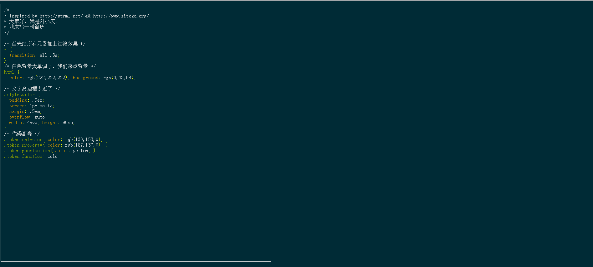

# hcq-AM
##  Used Name vfx-AM


>special-effects，About Myself,自我介绍


感兴趣的童鞋可以来个star

## 链接

http://huangchongqing.top/am/

## 截图



## 安装与运行
```
git clone https://github.com/ HuangCongQing/hcq-AM.git

cd hcq-AM

npm install

npm run dev //服务端运行 访问 http://localhost:8080

npm run build //项目打包 

```


## DONE

* 添加动态打字效果
* 添加md文档格式
* [添加背景音乐](https://blog.csdn.net/woyidingshijingcheng/article/details/75311699)


## TO DO


## LICENSE

本项目全部内容遵守 MIT 许可协议.